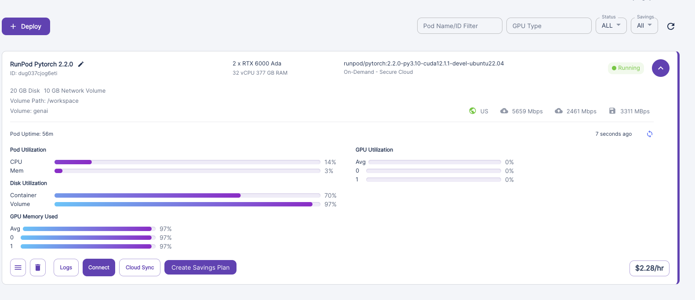
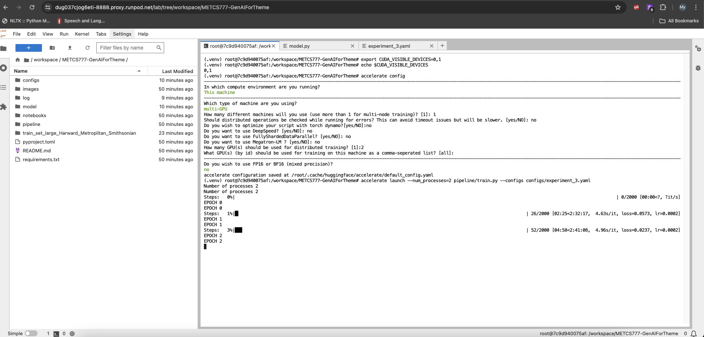
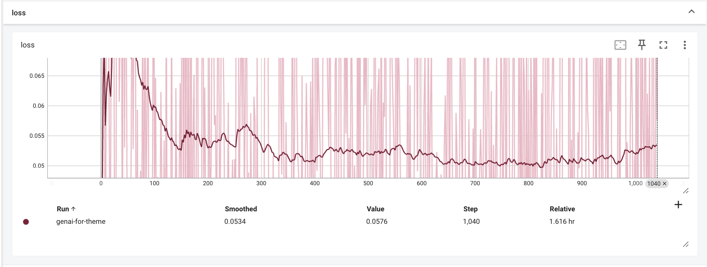
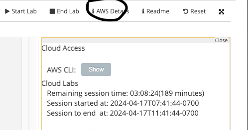

# METCS777-GenAIForTheme
This repository is a project for METCS777. This project focuses on fine-tuning Gen AI models for theme specific content

## Data Collection and preprocessing
### 1. Data Collection
The data we used for this projects are obtained via webscrapping (using `beautifulSoup` and `Selenium`) from the following sources:
- Harvard Museum: https://api.harvardartmuseums.org
- Metropolitan Museum: https://collectionapi.metmuseum.org/public/collection/v1/objects/
- Smithsonian Museum: https://api.si.edu/openaccess/api/v1.0/search
- Palace Museum:

After scrapping, this set of data is updated to the project [Shared Drive](https://drive.google.com/drive/folders/1J70ptj8vnAED8X9K9nGmTsjAirwJY0xR?usp=sharing) for further proccessing in EMR.

### 2. Preprocessing
There are 2 preprocessing steps that need to happen on the raw data just scrapped, the caption processing and image preprocessing.

#### 2.1. Caption preprocessing process

(TODO: describe the caption generation, metadata.csv file generation and the script name you used)

At the end of this process, a `metadata.csv` file is created with the following columns (`file_name`, and `caption`). The data in `metadata.csv` has the following format

| file_name | caption |
|--|--|
| <image_name>.jpg or <image_name>.png | Text string describing the image |

#### 2.2. Image preprocessing process with Spark

(TODO: describe the parquet file generation process, and the actual transformation that happended, and using what script / or code snippet)

At the end of this process, a `train_set.parquet` file is created with just the `pixel_value` <Type Torch.Tensor> and `input_ids` <Type Torch.Tensor>. These two columns, respectively, are the image embedding column and the caption embedding column. This `train_set.parquet` is ready to be read by the `torch.utils.data.DataLoader` for the model fine-tuning process.


Note that: The image preprocessing steps for this process happened seperately on each of us lab account, therefore to share the data between us, we used our project Google Drive.

## Fine-tuning process
### 1. Pre-Requisite
To finetune `stable-diffusion-v1.5`, at least 1 GPU of at least 24GB is required. An example of GPU of this type is L4 from Google Colab Pro. However, for the best result (within reasonable amount of time), also tried distributed training with Huggingface's `accelerate` api on a 2-GPUs instance, each with 48G VRAM (screenshot below). For this option we choose to rent GPU pods from [runpod.io](https://www.runpod.io/). We described the finetuning process below for each option

At the end of this finetuning process, a model pipeline is created saved in the `output`.`model` location in the `experiment_*.yaml` file you configured. This pipeline can be loaded in again for inference, using HuggingFace `StableDiffusionPipeline.from_pretrain()` API

### 2. Option 1: Fine-tune on Google Colab

To run the fine-tuning process on Google Colab Pro, one can use the `./examples/train_stable_diffusion_with_colab.ipynb` notebook. To configure your own parameter for training, you can reuse or create a new copy of `./configs/experiment_*.yaml` in directory location. The `experiement_*.yaml` file look something like this

```python
....
data:
  # The path to the local drive of the machine, where the training parquet files are stored
  # this assume you have moved data there before hand
  path: "./train_set_large_Harward_Metroplitan_Smithsonian/"
  # Other possible type are imagefolder, csv, ... (which is coming from huggingface load_dataset())
  type: "parquet"
training:
  learning_rate: 0.0001
  batch_size: 16
  epochs: 1
  max_train_steps: 2000
output:
  # The path where the model ouput will be stored
  model: "./output/"
  log: "./log/"
```

Then, in the notebook cell, change the `train()` function to:

```python
def train():
   with open("./configs/<your experiment file>.yaml") as infile:
         configs = safe_load(infile)
   .... 
```

### 3. Option 2: Fine-tune on runpod.io rented GPU servers
If you can rent Pods on **Runpod.io**, we recommend at least an instance with 2 GPUs, each with a 48GB of VRAM (so total 96GB). The exact instance we used for finetuning is screenshot below:



Once you deploy your pod, you can choose to connect to it by clicking on Connect button, and choose any of these option:
- ssh
- Web terminal
- Jupyter Lab (recommended if you want a SageMaker-like interative environment)

Next, we need to setup this instance with all the dependencies for training pytorch model with accelerate. Create a new terminal, then you can execute the following shell command one by one

```bash
git clone https://github.com/mytnguyen26/METCS777-GenAIForTheme.git
export PYTHONPATH="$PYTHONPATH:/workspace/METCS777-GenAIForTheme/"
cd METCS777-GenAIForTheme
python -m venv .venv
source ./.venv/bin/activate
pip install -r requirements.txt
gdown --folder <your train_set.parquet folder URL in google drive, assume that folder is available to the public>
export CUDA_VISIBLE_DEVICES=0,1
```

Or, just run the script `init_runpod.sh` (change google drive folder path or remove if you dont use google drive)

```bash
source ./shell/init_runpod.sh
```

Make sure to create your own `experiment.yaml` file with all the paths configured (refer to option 1 for example)

Finally, in your terminal, run the following command to set up the accelerate config to train. It will ask you some questions to correctly configure the training.

```bash
accelerate config
```
Then, you can finally execute the training in the terminal, as shown in the screenshot below

```bash
accelerate launch --num_processes=2 pipeline/train.py --configs configs/experiment_3.yaml
```



For more detail on what are the supported arguments to further configured accelerate, refer to the Accelerate Doc [here](https://huggingface.co/docs/accelerate/basic_tutorials/launch)

### 4. Alternative options
The finetuning process can be easily adapt to other training option, such as with Spark MLLib, or SageMaker by using `./pipeline/train.py` script as an entrypoint. However, due to the cost of renting out AWS GPU Instances, we quickly abandoned this idea.


## Inference and Result
### 1. Evaluation
Evaluation strategy we decided to use for this project is to have human SME as evaluator, who would visually compare images generated by `stable-diffusion-v1-5` versus images generated by our fine-tuned `stable-diffusion`.

### 2. Result
Below are images generated from the best experiment we had (using `./configs/experiment_4.1.yaml`). The total training time was ~1.5 hours on 2 RTX6000 ADA GPUs instance.


And below is the training loss over 40 EPOCHs (batch size 16)



## Some additional instructions for Developers

### Git Commit and SageMaker instruction

To facilitate colaboration, we can push our notebooks and codes to GitHub. Then Sagemaker server (Jupyter Lab) in each individual accounts can pull from our central Github Repository. To setup:

1. In your GitHub setting, create a personal access token, follow instruction [here](https://docs.github.com/en/authentication/keeping-your-account-and-data-secure/managing-your-personal-access-tokens)
2. In AWS console, navigate to SageMaker service -> Notebook -> Git Repository. Follow this intruction from AWS to connect to GitRepository

3. Now, when we launch Jupyter Lab and Jupyter Notebook, we can pull/push from repository using the Terminal, or by executing
```
!git pull origin main
```
in the notebook cell

https://aws.amazon.com/blogs/machine-learning/amazon-sagemaker-notebooks-now-support-git-integration-for-increased-persistence-collaboration-and-reproducibility/

### If you are using the lab and want to connect to AWS
1. In your labmodule, get your credentials detail and follow instruction to add to `~/.aws/credentials` config

